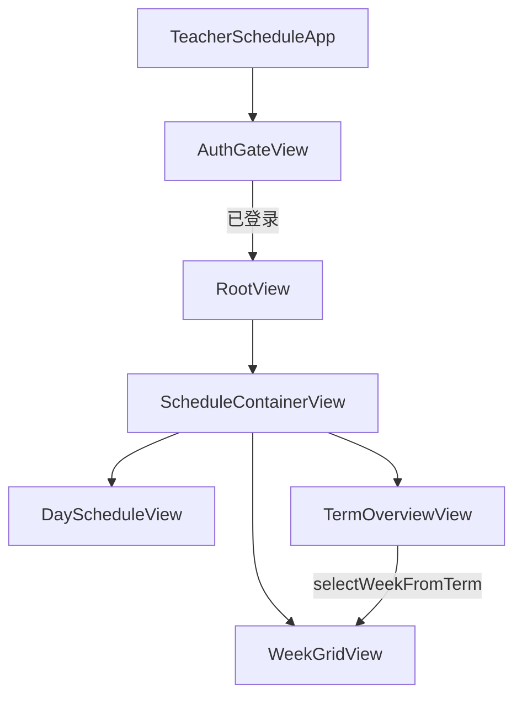

# 架构说明

## 状态中心：`ScheduleStore`

单一 `@Observable` 对象，经 `.environment(store)` 注入全应用。

```
ScheduleStore
├── 数据: currentTerm, sessions[], practiceBlocks[]
├── 导航: segment, selectedDate, selectedWeekIndex
├── 偏好: alwaysShowWeekend (UserDefaults)
└── 方法: occurrences(on:), occurrences(inWeek:), selectWeekFromTerm(_:)
```

**原则**：视图不直接算周次/展开，一律问 `ScheduleStore` 或 `OccurrenceExpander`。

## 数据模型

| 类型 | 含义 |
|------|------|
| `Term` | 学期名、开学日、总周数、`weekOffset` 手动校正 |
| `ClassSession` | 一条教务记录（一格），含 `weekPattern` |
| `PracticeBlock` | 集中实践（按指定周） |
| `Occurrence` | 展开结果：某周某天的某一节课 |

`WeekPattern` 解析 `1-9,11-13` → `ranges`，`contains(week:)` 驱动是否显示。

## 视图流



## 周视图列数

```
alwaysShowWeekend == true  → 1...7
else 当前周 Occurrence 含 weekday 6 或 7 → 1...7
else → 1...5
```

学期周条 `WeekSummary.sessionCount` **含周末**，避免「仅周六有课」的周显示为空条。

## 服务边界（待实现）

- **PDFImportService**：`URL → ([ClassSession], [PracticeBlock], termName?)`
- **ScheduleSyncService**：`SchedulePayload` ↔ 云端（登录后）

## 登录

`AuthGateView` → Sign in with Apple（正式）/ 开发跳过 → `isAuthenticated`。

未登录不展示课表；登录后无数据则引导导入。
